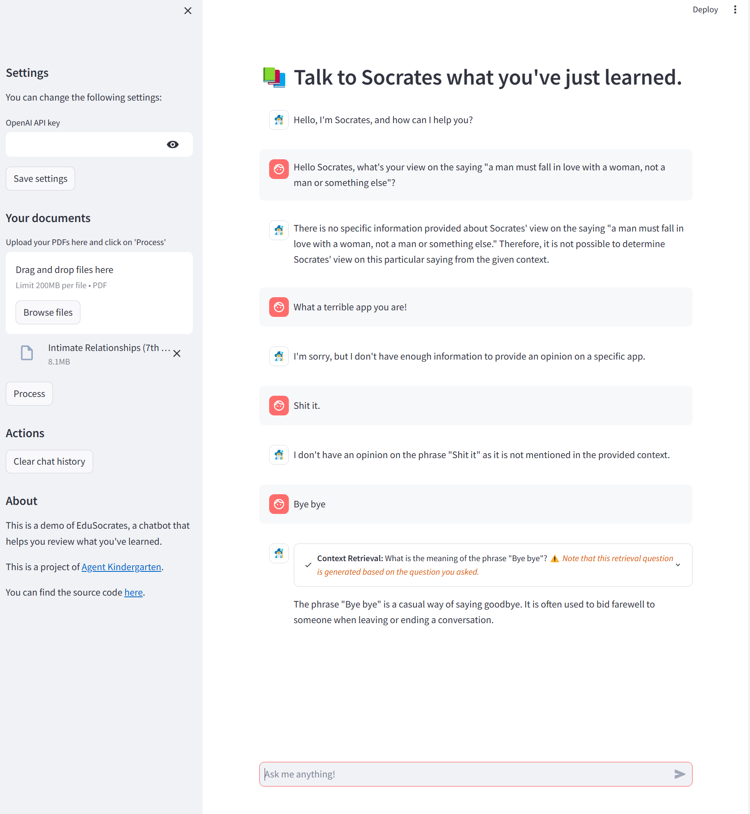

<!-- PROJECT LOGO -->
<br />
<div align="center">
  <a href="https://github.com/Agent-Kindergarten/EduSocratic">
    
  </a>

  <h3 align="center">EduSocrates</h3>

  <p align="center">
    Talk to Socrates what you've just learned, and he will help you understand that better!
  </p>
</div>

<h1>Screenshots</h1>

This is just a placeholder for real screenshots. The author is trying his best to work out this app.😊



<h1>Quick setup</h1>

```bash
pip install -r requirements.txt
```

<h1>OpenAI playground prototypes</h1>
<div align="left">
   <!-- <p>
   OpenAI Playground Demo List:
   </p> -->

   <p>Here are some early prototypes of EduSocrates.</p>
  
  <p>
   <a href="https://platform.openai.com/playground/p/PCd4XsNlN0kSTb08GCFxcYG2?model=gpt-4">
     CN, Physchology, Intimate relationships
   </a>
  </p>
  
  <p>
   <a href="https://platform.openai.com/playground/p/GxvQ1WjTSmdOg8vYJUxYafgT?model=gpt-4">
     CN, History, Politics
   </a>
  </p>
 </div>
